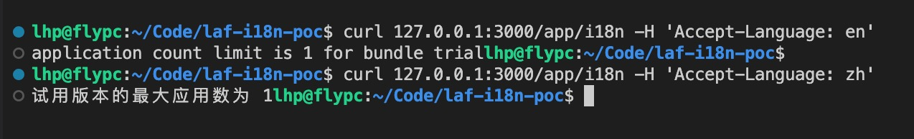

# laf server i18n poc

## 中文介绍

这是 laf-server 的国际化的 POC 项目，演示了最基本的如何使用 [nestjs-i18n](https://nestjs-i18n.com/quick-start) 来实现将接口返回值全部国际化。

### 难点介绍

与文档的国际化不同，server的国际化往往夹杂着变量，而插槽的位置在不同语言中可能不同。例子如下：

* 文档国际化的话，只需要把 "Create an app" 作为键，然后加一个 `{"Create an app": "新建应用"}` 就行
* server 国际化，不同语言表述可能不一致
  * 英语："application count limit is {limit} for bundle trial"
  * 中文："试用版本的最大应用数为 {limit}"

### 方案

#### nestjs-i18n 概述

[nestjs-i18n](https://nestjs-i18n.com/quick-start) 其实是直接包含了插槽的整个消息作为了一个 key。

并且通过 json 来配置。

可以看到本项目 [`src/i18n`](src/i18n/) 下面有多个文件夹，以语言的缩写来命名。

假如我们建了一个en文件夹，并创建了一个 `application.json` 的文件，专门用来处理应用相关的提示，并且在其中写入:

```json
{
  "CREATE": {
    "TrailMaxLimit": "application count limit is {limit} for bundle trial"
  },
}
```

那么其实引入的时候，只要用 `application.CREATE.TrailMaxLimit` 就能取出对应的模板，即格式为 `文件名.json路径`。

#### 语言自动选择

如何决定到底调用哪个语言呢，nestjs-i18n 将这个称为 [resolvers](https://nestjs-i18n.com/quick-start#add-resolvers)，预设了一些获取语言的方法，比如从请求头，从Cookie中等等。

#### 关键代码讲解

最关键的代码在这里，其他依赖引入等可以参考官方文档

```typescript
async i18nExample(@I18n() i18n: I18nContext) {
  const limit = 1;
  return i18n.t('application.CREATE.TrailMaxLimit', {
    args: { limit: limit },
  });
}
```

可以看到，通过 `i18n.t` 来调用多语言模板，以及一个可选的 `args`。

#### 运行与示例

```shell
npm install
npm run start
```




